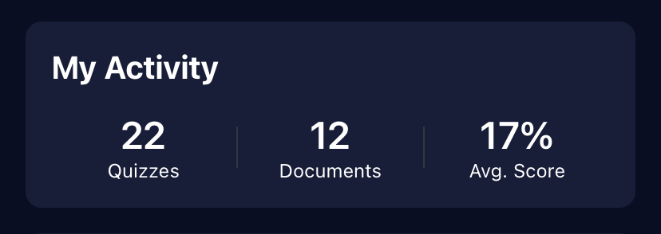

# Groundschool AI - Live Demo & Screenshots 🎬

## 🌐 Live Demo

**Experience Groundschool AI in action**: [https://groundschool-ai.vercel.app](https://groundschool-ai.vercel.app)

### Demo Features Available:
- Upload aviation documents (PDF, DOCX, TXT, images)
- AI-powered exam generation from your documents
- Interactive exam taking with instant feedback
- Progress tracking and analytics
- Multi-document processing capabilities
- Offline functionality testing

### Test Account (Optional):
- **Email**: demo@groundschool.ai
- **Password**: DemoPass123

*Note: You can also create your own account to test the full registration flow*

## 📱 Platform Availability

| Platform | Status | Access Method |
|----------|--------|---------------|
| **Web (PWA)** | ✅ Live | [groundschool-ai.vercel.app](https://groundschool-ai.vercel.app) |
| **iOS** | 🚧 Development | Expo Go App |
| **Android** | 🚧 Development | Expo Go App |

## 📸 Application Screenshots

### 1. Main Dashboard

*Central hub showing document upload, storage usage, and navigation to key features. The clean, aviation-themed interface provides easy access to all core functionality.*

### 2. Interactive Exam Interface

*Clean, focused interface for taking AI-generated exams. Features multiple-choice questions with clear options and intuitive navigation between questions.*

### 3. Progress Analytics & Results

*Comprehensive performance tracking and learning analytics showing detailed progress metrics, performance trends, and learning insights.*

### Additional Screenshots Available
*The application includes many more screens and features:*
- Welcome & Authentication screens
- Document upload interface with drag-and-drop support
- Real-time AI exam generation with progress tracking
- Instant feedback with detailed explanations
- Exam history and performance trends
- User profile management and settings
- Captain's Club subscription management
- Offline functionality and sync capabilities

## 🎯 Key Demo Scenarios

### Scenario 1: Basic User Journey
1. **Sign Up**: Create a new account with email/password
2. **Upload Document**: Upload a sample aviation PDF or image
3. **Generate Exam**: Watch AI create questions from your document
4. **Take Exam**: Experience the interactive exam interface
5. **View Results**: See detailed performance analytics

### Scenario 2: Multi-Document Processing
1. **Upload Multiple Files**: Add several related aviation documents
2. **Generate Comprehensive Exam**: Create questions from all documents
3. **Experience Balanced Questions**: See how AI balances content from multiple sources

### Scenario 3: Subscription Flow
1. **Explore Limitations**: Try to access premium features on free plan
2. **Upgrade Process**: Test the PayFast payment integration
3. **Premium Features**: Experience unlimited exams and storage

### Scenario 4: Offline Capabilities
1. **Go Offline**: Disconnect from internet
2. **Queue Operations**: Try uploading documents or generating exams
3. **Sync on Reconnect**: Watch operations complete when back online

## 🔧 Technical Demo Features

### AI Processing Demonstration
- **Document Analysis**: See how AI extracts key concepts from aviation materials
- **Question Quality**: Experience contextually relevant multiple-choice questions
- **Error Handling**: Robust processing of various document formats and sizes
- **Progress Feedback**: Real-time updates during AI processing

### Performance Showcases
- **Fast Loading**: Optimized for quick startup and navigation
- **Responsive Design**: Seamless experience across device sizes
- **Offline Support**: Functional even without internet connection
- **Error Recovery**: Graceful handling of network issues and failures

### Security Features
- **Rate Limiting**: Protection against API abuse (try rapid requests)
- **Data Protection**: Secure document storage and user data handling
- **Authentication**: Secure login/logout flows with session management

## 📊 Performance Metrics

### Load Times
- **Initial Load**: < 3 seconds on 3G connection
- **Document Upload**: < 5 seconds for typical PDFs
- **Exam Generation**: 30-60 seconds depending on document size
- **Exam Loading**: < 2 seconds for generated exams

### Supported Document Sizes
- **Maximum Size**: 10MB per document
- **Optimal Size**: 1-5MB for best performance
- **Formats**: PDF, DOCX, TXT, JPG, PNG, HEIC

### AI Processing Capabilities
- **Single Document**: 5-50 questions generated
- **Multi-Document**: Up to 100 questions from multiple sources
- **Processing Time**: Scales with document complexity
- **Success Rate**: >95% successful question generation

## 🎮 Interactive Demo Guide

### Getting Started (5 minutes)
1. Visit [groundschool-ai.vercel.app](https://groundschool-ai.vercel.app)
2. Create account or use demo credentials
3. Upload a sample aviation document
4. Generate your first AI exam
5. Take the exam and view results

### Advanced Features (10 minutes)
1. Upload multiple related documents
2. Generate comprehensive multi-document exam
3. Explore Captain's Club features
4. Test offline functionality
5. Review detailed analytics

### Developer Features (15 minutes)
1. Inspect network requests and API calls
2. Test error handling scenarios
3. Examine responsive design across devices
4. Explore PWA installation capabilities
5. Test performance with large documents

## 🚀 What Makes This Demo Special

### Real AI Processing
- **Not Mock Data**: Actual Google Gemini AI processing your documents
- **Dynamic Generation**: Questions created in real-time from your content
- **Contextual Relevance**: Aviation-specific question generation

### Production-Ready Features
- **Full Authentication**: Complete user management system
- **Payment Integration**: Real PayFast payment processing
- **Data Persistence**: Your data is saved and accessible across sessions
- **Security**: Production-level security measures implemented

### Cross-Platform Experience
- **Web PWA**: Full desktop and mobile web experience
- **Responsive**: Adapts to any screen size
- **Offline Capable**: Works without internet connection
- **Fast**: Optimized for performance across devices

## 📞 Demo Support

Having issues with the demo? Contact us:
- **Email**: selezmj@gmail.com
- **Issues**: Report bugs via GitHub Issues
- **Feedback**: We welcome your thoughts and suggestions

---

*Experience the future of aviation education with AI-powered learning* ✈️🤖
