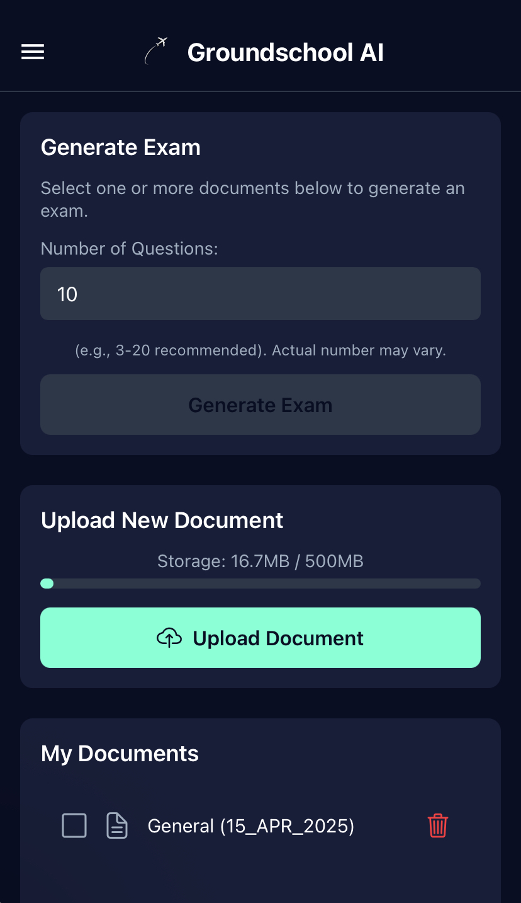
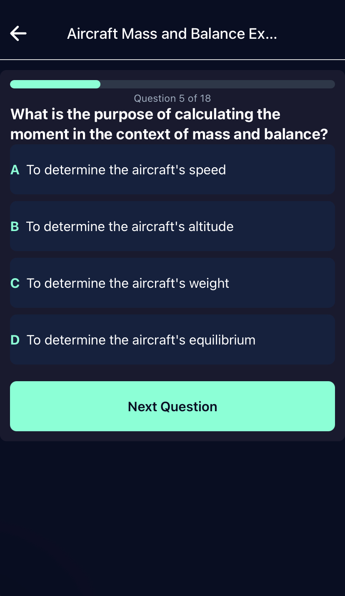
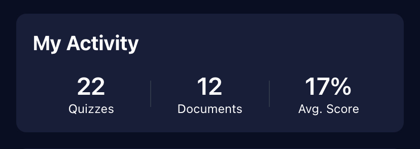

# Groundschool AI 🛩️
*An AI-powered study application for aviation students that transforms documents into interactive exams*

[](https://groundschool-ai.vercel.app)
[]()
[]()
[]()
[]()
[]()

## 🚀 Overview

Groundschool AI revolutionizes aviation education by using advanced AI technology to convert static study materials into dynamic, interactive examinations. Built specifically for aviation students preparing for theoretical exams.

### 🎯 Problem Solved
Traditional aviation study materials are static PDFs and textbooks that don't provide interactive learning experiences. Students struggle to:
- Test their knowledge effectively
- Identify weak areas in their understanding
- Get immediate feedback on their progress
- Process large volumes of aviation documentation efficiently

### 💡 Solution
Groundschool AI uses artificial intelligence to:
- Parse aviation documents and textbooks (PDF, DOCX, TXT, images)
- Generate contextually relevant questions automatically
- Provide instant feedback and detailed explanations
- Track learning progress and identify knowledge gaps
- Support multi-document processing for comprehensive exams

## 📸 Screenshots & Demo

### Dashboard Overview

*Main dashboard showing document upload, storage usage, and navigation to key features*

### Exam Interface

*Interactive exam interface with AI-generated questions and clean, focused design*

### Progress Analytics

*Comprehensive learning analytics showing performance metrics and progress tracking*

## ✨ Key Features

- **🤖 AI-Generated Questions**: Automatically creates exam questions from uploaded documents using Google Gemini AI
- **📊 Progress Tracking**: Visual analytics showing learning progress and performance metrics
- **⚡ Instant Feedback**: Immediate explanations for correct/incorrect answers
- **📚 Multi-Document Processing**: Generate comprehensive exams from multiple documents simultaneously
- **🎨 Interactive UI**: Clean, aviation-inspired dark theme designed for focused learning
- **📱 Cross-Platform**: Works seamlessly on iOS, Android, and Web (PWA)
- **💾 Offline Support**: Queue operations when offline, sync when connection is restored
- **🔒 Secure**: Comprehensive security with rate limiting and data protection
- **💳 Subscription Plans**: Free basic plan and premium Captain's Club membership

## 🛠️ Technology Stack

- **Frontend**: React Native with Expo SDK 51, Expo Router, React Navigation
- **Backend**: Supabase (PostgreSQL, Authentication, Storage, Edge Functions)
- **AI/ML**: Google Gemini API, Advanced NLP for document processing
- **Payment**: PayFast integration for South African market
- **Deployment**: Vercel (Web), Expo (Mobile)
- **Security**: Row Level Security, Rate Limiting, Environment Variable Protection

## 🔧 Installation & Setup

### Prerequisites
- Node.js (v18 or higher)
- npm or yarn
- Expo CLI (`npm install -g @expo/cli`)
- Supabase account
- Google AI API key
- PayFast merchant account (for payments)

### Quick Start
```bash
# Clone the repository
git clone https://github.com/selezai/Groundschool-AI.git

# Navigate to project directory
cd Groundschool-AI

# Install dependencies
npm install

# Set up environment variables
cp .env.example .env
# Add your API keys to .env file

# Run development server
npm start

# For specific platforms:
npm run web      # Web development
npm run ios      # iOS simulator  
npm run android  # Android emulator
```

### Environment Configuration
See [INSTALLATION.md](INSTALLATION.md) for detailed setup instructions.
- Row Level Security (RLS) on all database tables
- Secure file upload with size and type validation
- API key restrictions and environment isolation
- Encrypted payment processing via PayFast

### Authentication
- Supabase Auth with email/password
- Session management and automatic refresh
- Secure profile data handling
- Password reset functionality

## 🐛 Known Issues & Limitations

### Current Limitations
- Document size limit: 10MB (prevents AI response truncation)
- Maximum 20 quizzes per user (automatic cleanup)
- Web platform: Alert.alert doesn't work (custom modals used)
- HEIC image support may vary by platform

### Troubleshooting
- **Quiz Generation Fails**: Check document size and format
- **Payment Issues**: Verify PayFast credentials and ITN endpoints
- **Offline Sync Problems**: Check network connectivity and retry
- **Theme Issues**: Ensure ThemeProvider is properly configured

## 🤝 Contributing

### Development Workflow
1. Create feature branch from `main`
2. Follow existing code style and patterns
3. Add tests for new functionality
4. Update documentation as needed
5. Submit pull request with detailed description

### Code Style
- ESLint configuration enforced
- React Native best practices
- Consistent error handling patterns
- Comprehensive logging throughout

## 📄 License

Copyright © 2025 Groundschool AI. All rights reserved.

## 📞 Support

- **Email**: groundschoolai@gmail.com
- **Documentation**: See `/docs` folder
- **Issues**: Create GitHub issue with detailed description

## 🎯 Roadmap

### Upcoming Features
- Enhanced AI question types (drag-drop, fill-in-blank)
- Study progress analytics and insights
- Collaborative study groups
- Advanced document processing (OCR, handwriting)
- Mobile app store releases

### Performance Improvements
- Optimized AI response handling
- Enhanced offline capabilities
- Improved quiz generation speed
- Better error recovery mechanisms

---

**Built with ❤️ for aviation students worldwide**
